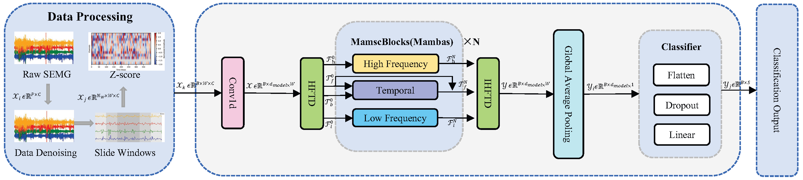
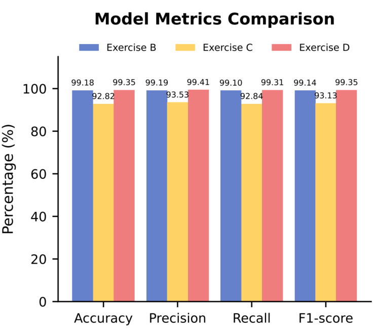
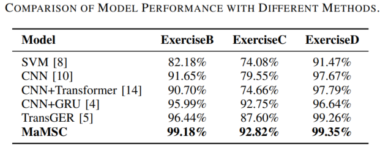

#  🐍 Mamba-based Multi-Scale Classification Framework for sEMG Gesture Recognition🚩

## 🌟 Contributions

* We propose a novel multi-scale classification framework based on multipath Mamba for gesture recognition using sEMG signals. This framework achieves **decoupling and fusion of multi-scale time-frequency features through a** **HFTD and IHFTD module**.
* We design a multipath stacked Mamba encoder, termed **MamscBlocks**, to perform dedicated intra-scale modeling for **high-frequency, low-frequency, and time-domain residual signals**, enhancing discriminative sequence representation capabilities.
* Extensive experiments on the **Ninapro DB2 dataset** demonstrate that this method performs excellently on intra-subject gesture recognition tasks. With only a minimal amount of target user data for fine-tuning across subject tasks, the model achieves 93.56% accuracy, exhibiting low calibration costs and strong potential for real-world interaction adaptation.

## 🧩 Architecture

<div align="center">
  
</div>


## 📑 Full Results

<div align="center">
  
  
</div>


## 📡 Prerequisites

Ensure you are using Python 3.10 and install the necessary dependencies by running:

```
pip install -r requirements.txt
```

## 📊 Prepare Datastes

Begin by downloading the required datasets. All datasets are conveniently available at [Ninapro - DB2](https://ninapro.hevs.ch/instructions/DB2.html). Create a separate folder named `./dataset` and neatly organize all the mat files as shown below:
```
dataset
└── Ninapro_DB2
    └── S1_E1_A1.mat
    └── S1_E2_A1.mat
    └── S1_E3_A1.mat
    └── S2_E1_A1.mat
    ...

```

## 💻 Run

```shell
sh ./scripts/Mamsc_all.sh
```

## 🙏 Acknowledgement

Special thanks to the following repositories for their invaluable code and datasets:

- https://github.com/yedadasd/KARMA

